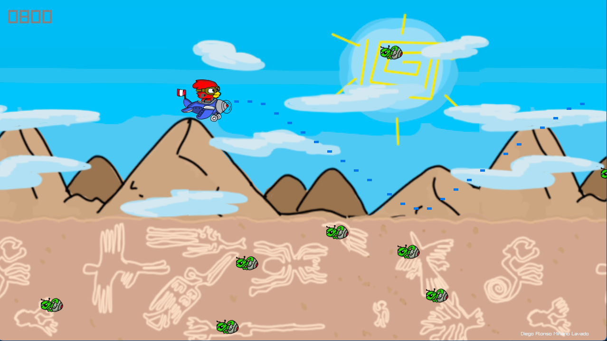
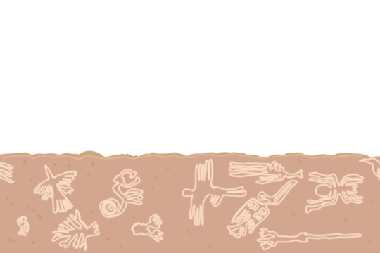

# Nazca Invasors

## About

**Nazca Invasors** is my first game developed for university, using C++ and Raylib. This horizontal shoot 'em up features a Gallito de las Rocas battling against aliens invading the Nazca Lines in Peru. The game uses a parallax effect to recreate the atmosphere of the Nazca Lines.

- **Character:** Gallito de las Rocas
- **Enemies:** Alien invaders
- **Environment:** Nazca Lines inspired terrain

## Installation

1. **Download the Game:**
   - Click the download button on the [Itch.io page](https://gatorrante.itch.io/nazcainvasors) to download the ZIP file containing the game.

2. **Extract the File:**
   - Locate the downloaded ZIP file (`NazcaInvasors.zip`) in your downloads folder.
   - Right-click the file and select "Extract here" or "Extract all...".

3. **Run the Game:**
   - Open the extracted folder and find `Dasher.exe`.
   - Double-click `Dasher.exe` to start the game.

4. **Enjoy!**
   - Once the game starts, you can begin fighting the alien invaders and save the Nazca Lines.

## Screenshots

## Textures

**Gallito de las Rocas:**

**Enemies:**

**Terrain:**

All sprites and environments are original and created by me using Photoshop and drawing skills.

## Links

- [Play Nazca Invasors on Itch.io](https://gatorrante.itch.io/nazcainvasors)

  
Leer en Español

  # Nazca Invasors

  
  
  
  

  

  ## Acerca de

  **Nazca Invasors** es mi primer juego desarrollado para la universidad, utilizando C++ y Raylib. Este juego de disparos en horizontal presenta a un Gallito de las Rocas luchando contra alienígenas que invaden las Líneas de Nazca en Perú. El juego utiliza un efecto de paralaje para recrear la atmósfera de las Líneas de Nazca.

  - **Personaje:** Gallito de las Rocas
  - **Enemigos:** Invasores alienígenas
  - **Entorno:** Terreno inspirado en las Líneas de Nazca

  ## Instalación

  1. **Descargar el Juego:**
     - Haz clic en el botón de descarga en la [página de Itch.io](https://gatorrante.itch.io/nazcainvasors) para descargar el archivo ZIP que contiene el juego.

  2. **Descomprimir el Archivo:**
     - Localiza el archivo ZIP descargado (`NazcaInvasors.zip`) en tu carpeta de descargas.
     - Haz clic derecho sobre el archivo y selecciona "Extraer aquí" o "Extraer todo...".

  3. **Ejecutar el Juego:**
     - Abre la carpeta descomprimida y busca `Dasher.exe`.
     - Haz doble clic en `Dasher.exe` para iniciar el juego.

  4. **¡Disfruta!**
     - Una vez que el juego se inicie, podrás comenzar a luchar contra los invasores alienígenas y salvar las Líneas de Nazca.

  ## Capturas de Pantalla

  

  ## Texturas

  **Gallito de las Rocas:**
  

  **Enemigos:**
  

  **Terreno:**
  

  Todos los sprites y escenarios son originales y creados por mí usando Photoshop y habilidades de dibujo.

  ## Enlaces

  - [Jugar a Nazca Invasors en Itch.io](https://gatorrante.itch.io/nazcainvasors)

